# Viewing the Architecture Atlas in Obsidian

This repository is designed so you can read the Architecture Atlas directly in Obsidian. Mermaid is used for the simpler conceptual and operational diagrams. PlantUML is used as the formal technical layer where it adds precision.

## What you need

1. Open the repository root as an Obsidian vault, or open the parent vault containing this repository.
2. Keep Obsidian's built-in Mermaid rendering enabled.
3. Enable your installed PlantUML community plugin.
4. Open `docs/architecture-atlas/README.md`.

## What you should see

The Level 0–3 pages primarily render Mermaid. Technical Level 4–5 pages render a Mermaid overview followed by a **Formal PlantUML View**.

For example, open:

`docs/architecture-atlas/12-c4-system-context.md`

The page contains:

1. plain-English explanation;
2. Mermaid overview;
3. formal PlantUML diagram;
4. interpretation;
5. technical notes;
6. links to the standalone source.

## Standalone PlantUML sources

Formal sources are under:

`docs/diagrams/plantuml/`

Open a `.puml` source when you want to inspect or edit the formal diagram itself. The Atlas Markdown page is normally the easiest reading experience.

## Important plugin note

The Atlas uses standard fenced PlantUML blocks:

````markdown

```plantuml
@startuml
...
@enduml
```

````

PlantUML community plugins can differ slightly. If your chosen plugin expects a different fence name or syntax, configure the plugin where possible rather than maintaining a second architecture source. The standalone `.puml` files remain canonical diagram-source companions to the normative VSO specification.

## Source-of-truth rule

Neither Mermaid nor PlantUML is allowed to invent architecture. The normative specification remains authoritative. See `09-hermes/ARCHITECTURE_DIAGRAM_POLICY.md`.

## Exporting diagrams

Rendered SVG/PNG files are optional export artifacts, not required repository sources. They can be generated later for PDFs, presentations, websites, or sharing with people who do not have Obsidian/PlantUML.
