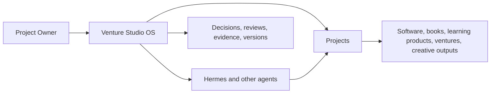

# Level 0 — What Venture Studio OS Does

> **Reading level:** Level 0 — Conceptual
> **Purpose:** Understand VSO in about 30 seconds
> **Source of truth:** `01-product/PRODUCT_VISION.md`, `06-workflows/UNIVERSAL_PROJECT_LIFECYCLE.md`

Venture Studio OS (VSO) is the control system between you, your projects, and the agents doing work. You define intent and approve important choices; VSO structures work, preserves decisions, and coordinates agents such as Hermes.

## Diagram

## What this means

VSO is not the worker and it is not the project itself. It is the operating layer that keeps the work organized, traceable, reviewable, and recoverable.

## Technical notes

The MVP is a modular monolith. Project types are configured by templates rather than separate application codebases. Repository records are authoritative for the build process.
