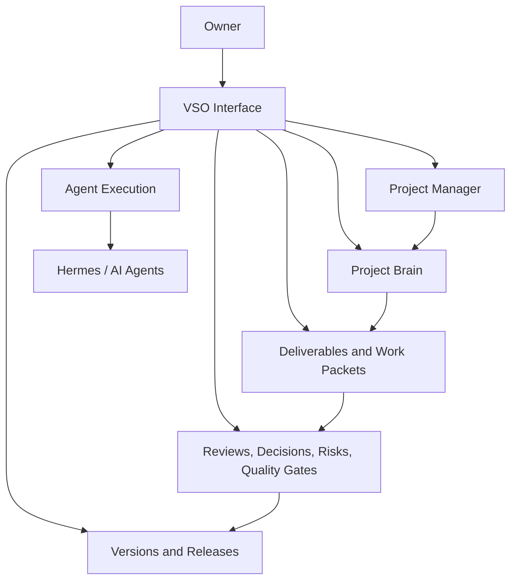

# Level 1 — Major Components

> **Reading level:** Level 1 — Functional
> **Purpose:** See the major responsibilities without implementation details
> **Source of truth:** `04-architecture/SYSTEM_ARCHITECTURE.md`, `02-requirements/FUNCTIONAL_REQUIREMENTS.md`

At this level, VSO can be understood as six cooperating capabilities: project management, structured project memory, work control, agent execution, governance, and version/release control.

## Diagram

## What this means

The owner works through one system, while VSO separates concerns internally so that project knowledge, execution, approval, and releases do not become mixed together.

## Technical notes

These functional areas map to domain modules defined by `04-architecture/SYSTEM_ARCHITECTURE.md`: Projects, Project Brain, Templates, Stages, Deliverables, Work Packets, Reviews/Approvals, Decisions, Risks, Versions, and Dashboards.
