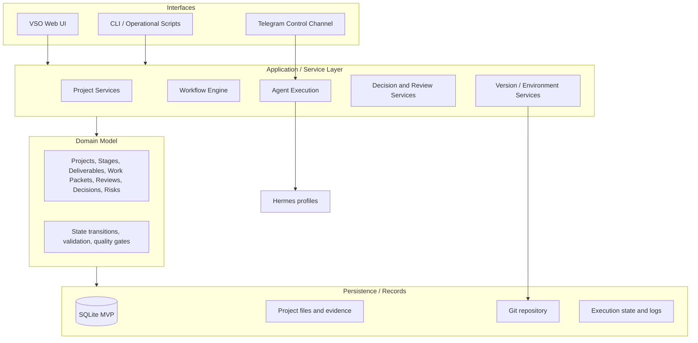

# Level 2 — System Architecture

> **Reading level:** Level 2 — Architecture
> **Purpose:** Understand how the application is divided into layers
> **Source of truth:** `04-architecture/SYSTEM_ARCHITECTURE.md`, `04-architecture/TECH_STACK.md`, `04-architecture/DATA_MODEL.md`

The MVP uses a modular-monolith architecture. The browser interface calls application services, which enforce domain rules and persist validated state. External integrations sit at controlled boundaries.

## Diagram

## What this means

UI, business rules, stored data, and external tools have distinct roles. That separation makes the system easier to reason about and later replace or scale individual parts.

## Technical notes

Presentation must not bypass application/domain validation. SQLite is the MVP database; Git is version-control/synchronization for repository state, not a replacement for a transactional database.
