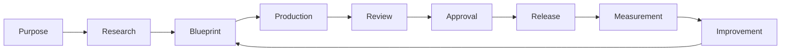

# Level 3 — Universal Project Lifecycle

> **Reading level:** Level 3 — Workflow
> **Purpose:** See how any project moves from idea to improvement
> **Source of truth:** `06-workflows/UNIVERSAL_PROJECT_LIFECYCLE.md`, `05-project-templates`

Every project type uses the same high-level lifecycle. Templates may rename or expand stages, but traceability from purpose to outcome must remain intact.

## Diagram

## What this means

A software product and a children’s book can have different detailed stages while still sharing a common operating logic: define why, design what, produce, verify, approve, release, learn, improve.

## Technical notes

Template stage definitions snapshot into project stages. A project has at most one active stage. Entry/exit criteria and quality gates determine controlled stage movement.
