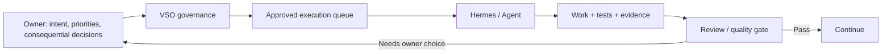

# Level 1 — Human + AI Collaboration

> **Reading level:** Level 1 — Functional
> **Purpose:** Understand what the owner decides and what agents execute
> **Source of truth:** `09-hermes/HERMES_RULES.md`, `09-hermes/AUTONOMOUS_EXECUTION_POLICY.md`, `09-hermes/DIRECTION_REQUIRED_PROTOCOL.md`

VSO uses bounded autonomy. Agents are expected to solve routine implementation problems, but consequential decisions remain with the owner.

## Diagram

## What this means

The goal is not to interrupt you for normal work and not to let an agent silently redefine the project. VSO defines the boundary between those two extremes.

## Technical notes

Autonomy is governed by `STOP_CONDITIONS.yaml`, retry policy, execution queue, direction protocol, and immutable decision records.
