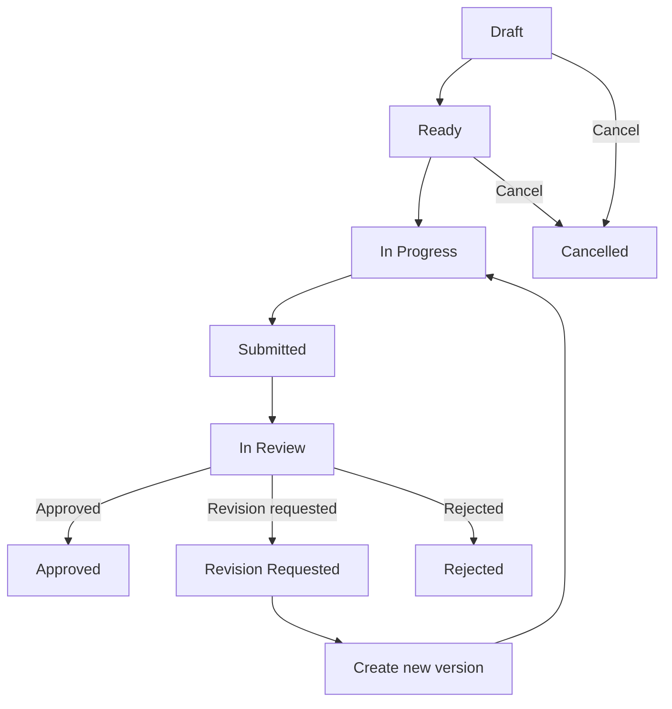

# Level 3 — Work Packet Execution

> **Reading level:** Level 3 — Workflow
> **Purpose:** See the normal unit-of-work lifecycle
> **Source of truth:** `06-workflows/WORK_PACKET_WORKFLOW.md`, `04-architecture/DATA_MODEL.md`, `08-quality/QUALITY_GATES.md`

A work packet is a bounded unit of work with an objective, scope, exclusions, outputs, acceptance criteria, and evidence. Hermes should execute work packets rather than vague project goals.

## Diagram

## What this means

Submission locks the work definition. A revision does not rewrite history; it creates a new version before the controlled fields can change.

## Technical notes

Canonical `WorkPacketStatus`: DRAFT, READY, IN_PROGRESS, SUBMITTED, IN_REVIEW, REVISION_REQUESTED, APPROVED, REJECTED, CANCELLED. Review/evidence rules are defined in the data model.
