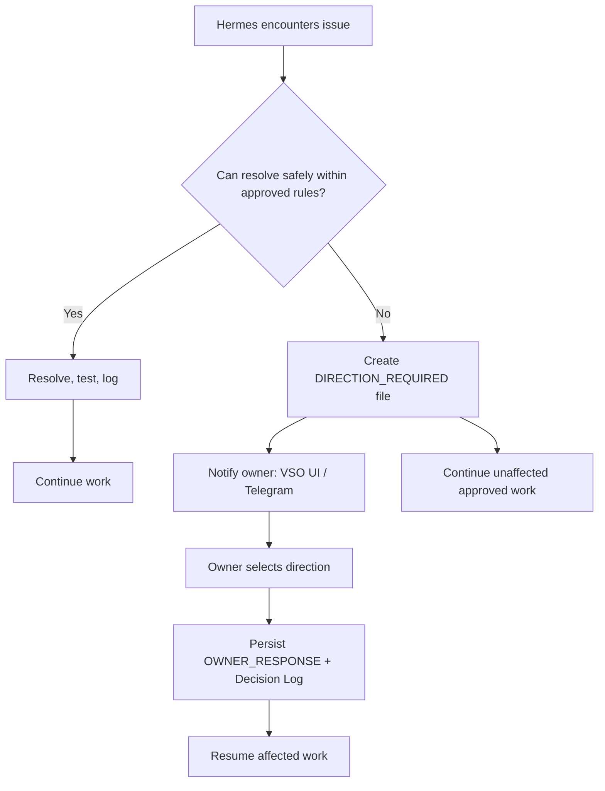

# Level 3 — Direction Required Workflow

> **Reading level:** Level 3 — Workflow
> **Purpose:** Understand when Hermes stops and how owner decisions return safely
> **Source of truth:** `09-hermes/DIRECTION_REQUIRED_PROTOCOL.md`, `docs/HOW_TO_ANSWER_DIRECTION_REQUESTS.md`, `09-hermes/telegram/TELEGRAM_DIRECTION_PROTOCOL.md`

Hermes should first distinguish routine recovery from a genuine owner decision. Only consequential ambiguity becomes a direction request.

## Diagram

## What this means

The conversation channel is not the authority. The owner’s answer must become a repository decision record before the blocked work resumes.

## Technical notes

Telegram responses are validated against project routing and pending decision IDs. Repository templates define the formal request/response format.
