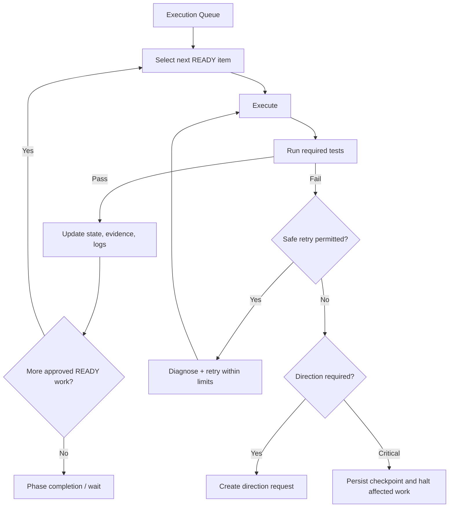

# Level 3 — Bounded Autonomous Hermes

> **Reading level:** Level 3 — Workflow
> **Purpose:** See how Hermes keeps working without becoming uncontrolled
> **Source of truth:** `09-hermes/AUTONOMOUS_EXECUTION_POLICY.md`, `09-hermes/EXECUTION_QUEUE.yaml`, `09-hermes/STOP_CONDITIONS.yaml`, `09-hermes/RETRY_POLICY.yaml`

Hermes works from a queue. After each unit it tests, records state, and selects the next eligible item. Routine failures are retried only within policy limits.

## Diagram

## What this means

Autonomy means “continue when the rules already determine the answer,” not “make any decision necessary to avoid stopping.”

## Technical notes

The queue, retry policy, stop conditions, activity log, and execution state together form the build-time control loop.
