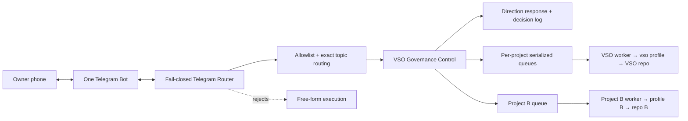

# Level 3 — Telegram Control

> **Reading level:** Level 3 — Workflow
> **Purpose:** Understand remote notifications and owner decisions
> **Source of truth:** `09-hermes/telegram/TELEGRAM_CONTROL_PLANE.md`, `09-hermes/telegram/PROJECT_ROUTING_POLICY.md`, `09-hermes/telegram/TELEGRAM_DIRECTION_PROTOCOL.md`

One Telegram bot is owned by one router process. Telegram topics map deterministically to a project, Hermes profile, and repository.

## Diagram

## What this means

Telegram is a transport/control layer, not project memory or a shell. It fails closed unless the owner is explicitly allowlisted, maps chat/topic IDs deterministically, rejects free-form execution, persists decisions first, and queues only governed work.

## Technical notes

The bot token is machine-local. Allowed Telegram user IDs, exact chat/topic routing, execution checkpoints, repository persistence, and one serialized worker queue per project enforce control boundaries while allowing different projects to run independently.
