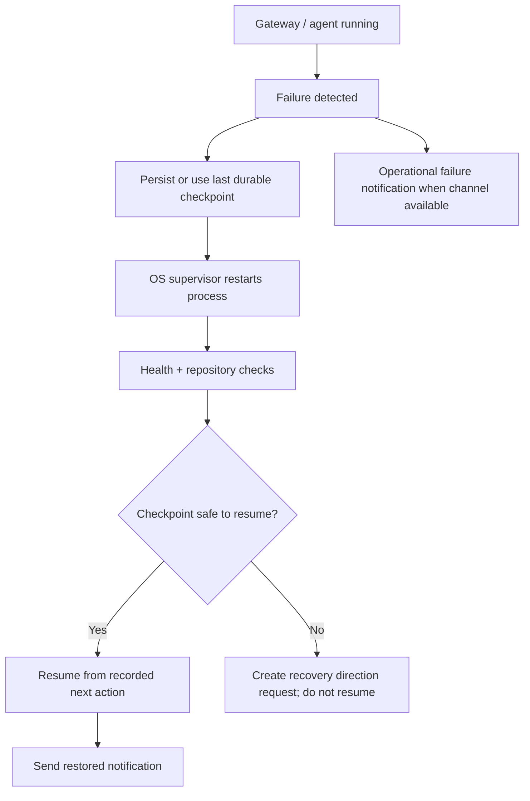

# Level 3 — Gateway Failure and Recovery

> **Reading level:** Level 3 — Workflow
> **Purpose:** See what happens when the control gateway fails
> **Source of truth:** `09-hermes/telegram/GATEWAY_RECOVERY_POLICY.md`, `09-hermes/telegram/CHECKPOINT_AND_RESUME_POLICY.md`, `09-hermes/EXECUTION_STATE.json`

Recovery relies on durable checkpoints, not conversational memory. A supervisor restarts the router, then state is validated before any project execution resumes.

## Diagram

## What this means

A restart is not treated as proof that work is safe. The repository, Git position, and last verified checkpoint must agree.

## Technical notes

Linux may use user-systemd; Windows may use Task Scheduler. `EXECUTION_STATE.json` stores the project execution checkpoint and Telegram router state stores handled update position.
