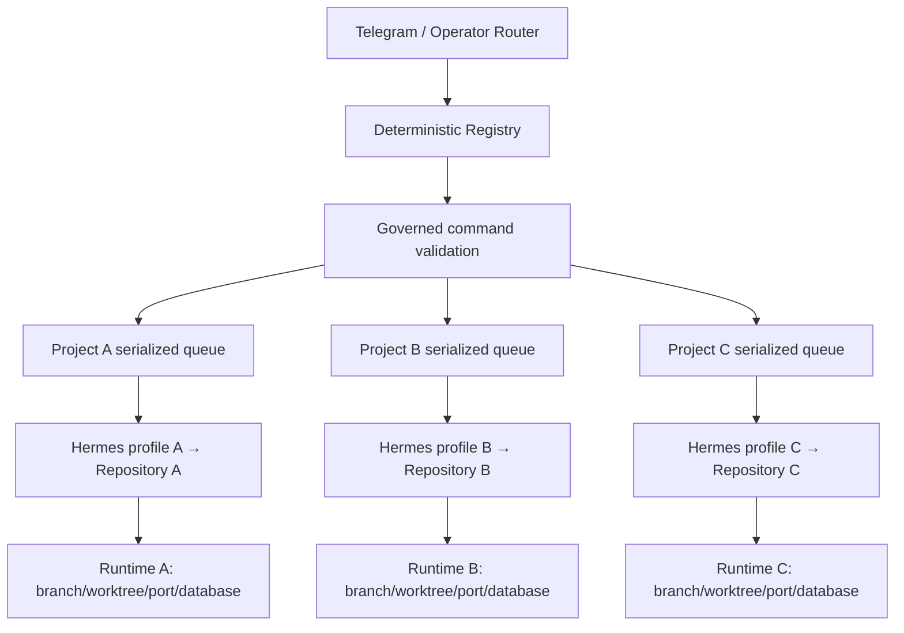

# Level 3 — Multi-Project Isolation

> **Reading level:** Level 3 — Workflow
> **Purpose:** See how one control plane safely manages several projects
> **Source of truth:** `09-hermes/telegram/PROJECT_ROUTING_POLICY.md`, `09-hermes/telegram/PROJECT_COMMUNICATION_REGISTRY.json`, `09-hermes/PARALLEL_ENVIRONMENT_RULES.md`

Each project has a deterministic route and its own Hermes profile/repository. Software runtime isolation additionally separates branches, worktrees, ports, databases, storage, and logs.

## Diagram

## What this means

One project’s message, memory, files, runtime or decisions should never be selected by guessing from natural language.

## Technical notes

Enabled Telegram routes must be unique by chat/topic. Each project has a separate worker queue so one long job does not block unrelated projects, while jobs inside the same project remain serialized. Software environments follow one-change/one-branch/one-worktree/one-port/one-database isolation rules.
