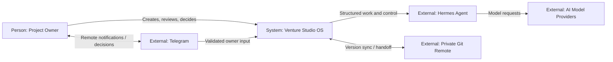
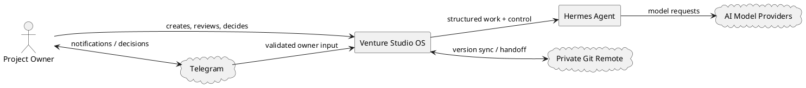

# Level 4 — C4 System Context

> **Reading level:** Level 4 — Technical
> **Purpose:** Show VSO and the external actors/systems around it
> **Source of truth:** `04-architecture/SYSTEM_ARCHITECTURE.md`, `09-hermes/telegram/TELEGRAM_CONTROL_PLANE.md`, `09-hermes/SMART_GIT_SYNC_POLICY.md`

This is the C4-style system context: VSO is the system of interest; owner, Hermes, Telegram, Git, and model providers sit outside its boundary.

## Diagram

## Formal PlantUML View

> **Obsidian:** With your PlantUML plugin enabled, the fenced block below renders directly in Reading view/Live Preview. The standalone editable source is [`../diagrams/plantuml/12-c4-system-context.puml`](../diagrams/plantuml/12-c4-system-context.puml).

## What this means

The context diagram focuses on responsibilities and boundaries rather than internal modules.

## Technical notes

This view corresponds to C4 Level 1. The PlantUML counterpart is `docs/diagrams/plantuml/c4-system-context.puml`.
