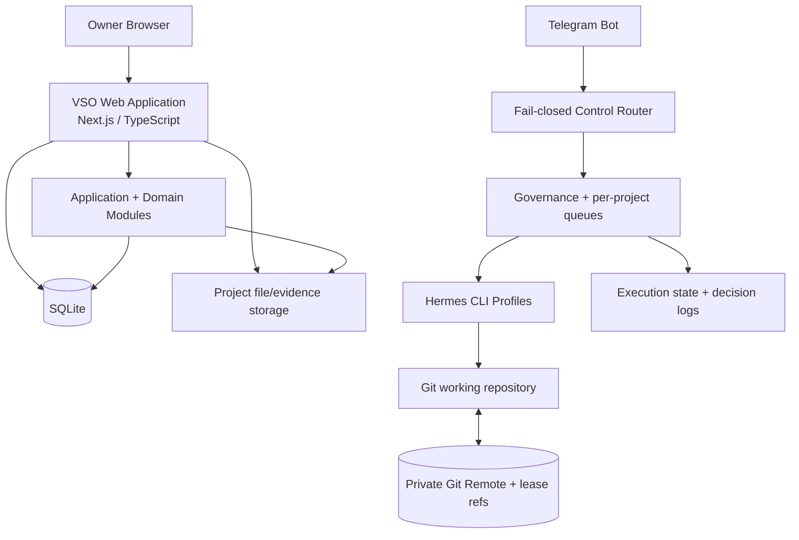

# Level 4 — C4 Containers

> **Reading level:** Level 4 — Technical
> **Purpose:** Show the deployable/runtime building blocks
> **Source of truth:** `04-architecture/SYSTEM_ARCHITECTURE.md`, `04-architecture/TECH_STACK.md`, `09-hermes/telegram/TELEGRAM_CONTROL_PLANE.md`

Within the system boundary, the MVP contains a web application, persistence, operational scripts/control services, and repository/runtime records.

## Diagram



## Formal PlantUML View

> **Obsidian:** With your PlantUML plugin enabled, the fenced block below renders directly in Reading view/Live Preview. The standalone editable source is [`../diagrams/plantuml/13-c4-containers.puml`](../diagrams/plantuml/13-c4-containers.puml).

```plantuml
@startuml
top to bottom direction
skinparam componentStyle rectangle
actor "Project Owner" as Owner
cloud "Telegram Bot" as Telegram
rectangle "VSO Runtime" {
  component "Web Application
Next.js / TypeScript" as Web
  database "SQLite" as DB
  folder "Project Files / Evidence" as Files
  component "Application + Domain Modules" as Domain
  component "Fail-closed Telegram Router" as Router
  component "Governance + Per-project Worker Queues" as Control
  component "Hermes CLI Profiles" as Hermes
  artifact "Execution State + Decision Logs" as State
  folder "Git Working Repository" as Repo
}
cloud "Private Git Remote
+ execution lease refs" as Remote
Owner --> Web
Telegram --> Router
Router --> Control
Control --> Hermes
Control --> State
Web --> Domain
Domain --> DB
Domain --> Files
Hermes --> Repo
Repo <--> Remote
@enduml
```

## What this means

A “container” in C4 means an independently running or storing part, not necessarily Docker.

## Technical notes

This is C4 Level 2. Deployment topology may differ between Windows and Linux, but repository contracts and data semantics remain the same.
