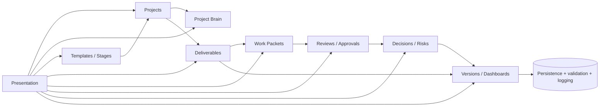
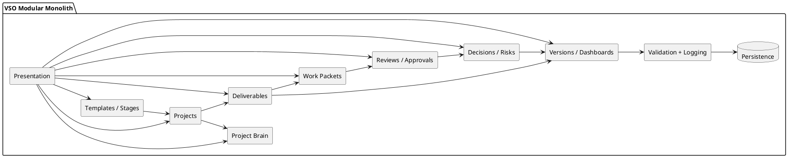

# Level 4 — Application Components

> **Reading level:** Level 4 — Technical
> **Purpose:** Show the logical modules inside the VSO application
> **Source of truth:** `04-architecture/SYSTEM_ARCHITECTURE.md`, `04-architecture/API_CONTRACTS.md`, `04-architecture/DATA_MODEL.md`

The modular monolith keeps one deployable application while separating domain responsibilities internally.

## Diagram

## Formal PlantUML View

> **Obsidian:** With your PlantUML plugin enabled, the fenced block below renders directly in Reading view/Live Preview. The standalone editable source is [`../diagrams/plantuml/14-application-components.puml`](../diagrams/plantuml/14-application-components.puml).

## What this means

The modules cooperate through application/domain contracts rather than becoming separate project-specific applications.

## Technical notes

This is C4 Level 3 style. Code-level diagrams should only be added when implementation exists and should reflect actual modules, not anticipated class names.
