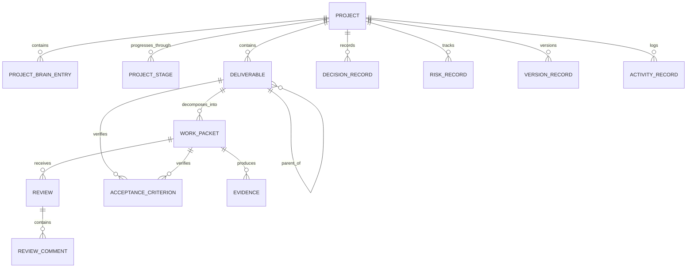
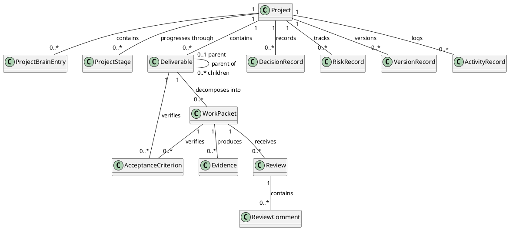

# Level 4 — Core Data Model

> **Reading level:** Level 4 — Technical
> **Purpose:** See the principal persisted relationships
> **Source of truth:** `04-architecture/DATA_MODEL.md`

This is a simplified relationship view. The normative field definitions, constraints, and archival rules remain in the data-model specification.

## Diagram

## Formal PlantUML View

> **Obsidian:** With your PlantUML plugin enabled, the fenced block below renders directly in Reading view/Live Preview. The standalone editable source is [`../diagrams/plantuml/15-core-data-model.puml`](../diagrams/plantuml/15-core-data-model.puml).

## What this means

Projects are the aggregate context. Deliverables organize outputs; work packets organize execution; reviews and evidence establish verification; decisions/risks/version/activity preserve governance history.

## Technical notes

Refer to `04-architecture/DATA_MODEL.md` for exact fields, enum values, relationship validation, immutability, archival, dependency cycles, and derived progress/health rules.
