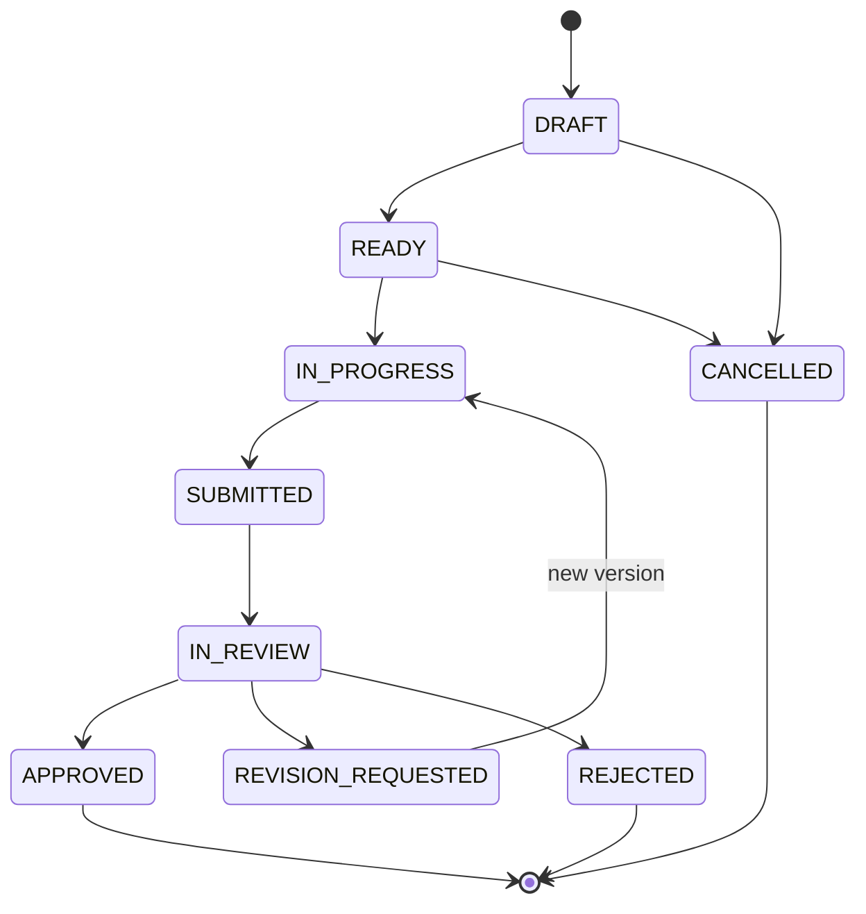
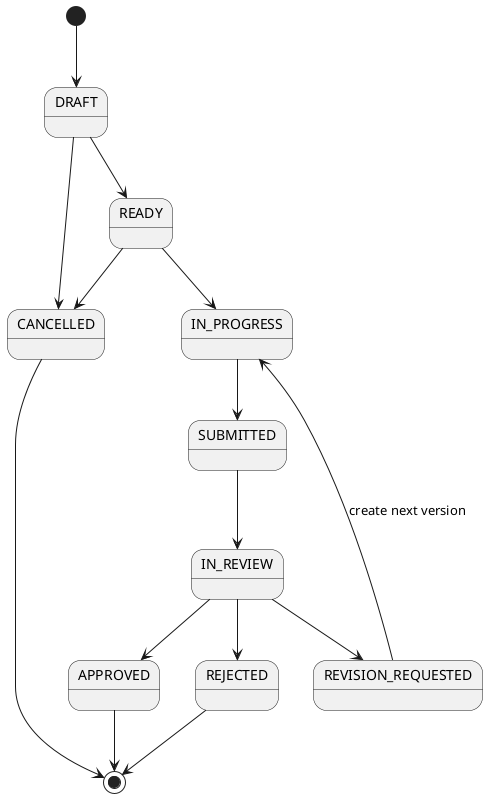

# Level 4 — Work Packet State Machine

> **Reading level:** Level 4 — Technical
> **Purpose:** Provide the canonical work-packet transition model
> **Source of truth:** `04-architecture/DATA_MODEL.md`, `06-workflows/WORK_PACKET_WORKFLOW.md`

This state machine makes invalid transitions visible and testable.

## Diagram

## Formal PlantUML View

> **Obsidian:** With your PlantUML plugin enabled, the fenced block below renders directly in Reading view/Live Preview. The standalone editable source is [`../diagrams/plantuml/16-work-packet-state-machine.puml`](../diagrams/plantuml/16-work-packet-state-machine.puml).

## What this means

Submitted packets cannot silently change their objective/scope/output contract. Revision creates the next version before editable work resumes.

## Technical notes

Tests should reject transitions not explicitly allowed by the workflow contract. Approval timestamps and submitted versions preserve history.
