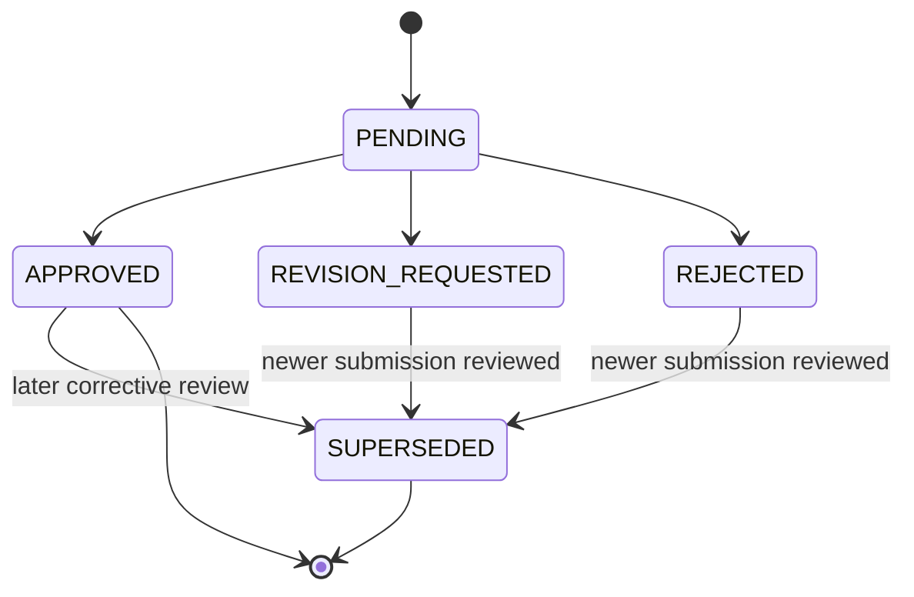
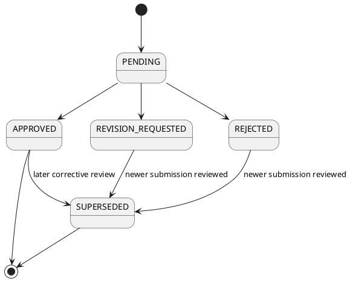

# Level 4 — Review / Approval State Machine

> **Reading level:** Level 4 — Technical
> **Purpose:** Show immutable review outcomes and supersession
> **Source of truth:** `04-architecture/DATA_MODEL.md`, `06-workflows/REVIEW_WORKFLOW.md`, `06-workflows/APPROVAL_WORKFLOW.md`

A review decision is immutable. If a correction is needed, a later review supersedes it rather than rewriting history.

## Diagram

## Formal PlantUML View

> **Obsidian:** With your PlantUML plugin enabled, the fenced block below renders directly in Reading view/Live Preview. The standalone editable source is [`../diagrams/plantuml/17-review-approval-state-machine.puml`](../diagrams/plantuml/17-review-approval-state-machine.puml).

## What this means

The state machine separates “the historical decision that happened” from “the current latest assessment.”

## Technical notes

Review comments are append-only. Decided reviews are immutable. Corrections use superseding records, supporting auditability.
