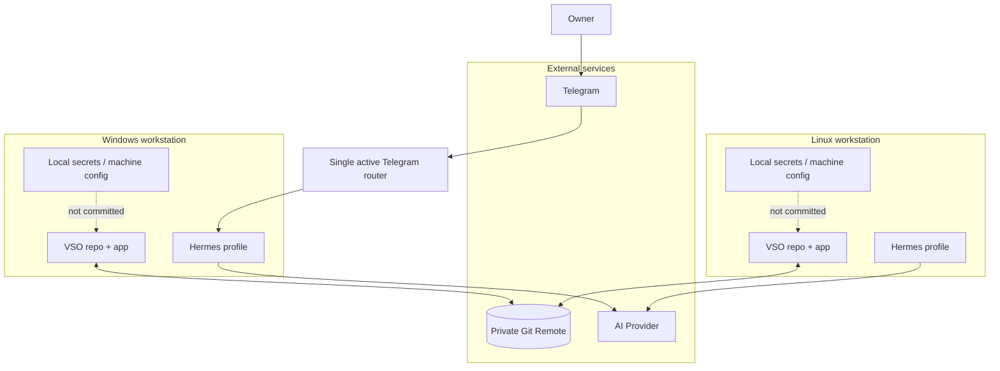

# Level 5 — Deployment and Security Boundaries

> **Reading level:** Level 5 — Infrastructure
> **Purpose:** Show where VSO runs and which boundaries require protection
> **Source of truth:** `04-architecture/SECURITY_MODEL.md`, `09-hermes/telegram/TELEGRAM_CONTROL_PLANE.md`, `09-hermes/SMART_GIT_SYNC_POLICY.md`, `docs/SMART_GIT_SYNC_GUIDE.md`

VSO may be used from Windows and Linux workstations connected by a private Git remote. Secrets and machine-specific paths remain local. Telegram is an optional remote control channel.

## Diagram



## Formal PlantUML View

> **Obsidian:** With your PlantUML plugin enabled, the fenced block below renders directly in Reading view/Live Preview. The standalone editable source is [`../diagrams/plantuml/18-deployment-security.puml`](../diagrams/plantuml/18-deployment-security.puml).

```plantuml
@startuml
top to bottom direction
skinparam componentStyle rectangle
actor "Project Owner" as Owner
cloud "Telegram" as TG
cloud "Private Git Remote" as Remote
cloud "AI Provider" as Provider
node "Windows Workstation" as Win {
  component "VSO Repo + App" as WinVSO
  component "Hermes Profile" as WinHermes
  artifact "Local Secrets +
Machine Config" as WinSecrets
}
node "Linux Workstation" as Lin {
  component "VSO Repo + App" as LinVSO
  component "Hermes Profile" as LinHermes
  artifact "Local Secrets +
Machine Config" as LinSecrets
}
component "Single Active
Telegram Router" as Router
Owner --> TG
TG --> Router
Router --> WinHermes
WinVSO <--> Remote
LinVSO <--> Remote
WinHermes --> Provider
LinHermes --> Provider
WinSecrets ..> WinVSO : local only / not committed
LinSecrets ..> LinVSO : local only / not committed
@enduml
```

## What this means

The private Git remote synchronizes repository state, not secrets or generated dependencies. Only one Telegram router owns the bot update stream.

## Technical notes

Security boundaries include Telegram identity/routing validation, local secret storage, Git remote trust, provider credentials, file sanitization, and application/domain validation. The diagram is descriptive; `SECURITY_MODEL.md` is normative.
