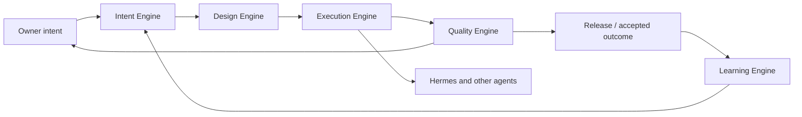

# Five Product-Development Engines

**Level 1–2 — Functional architecture**

> **Source of truth:** `01-product/VSO_PRODUCT_DOCTRINE.md` `04-architecture/SYSTEM_ARCHITECTURE.md`

## Plain-English explanation

VSO takes an owner's idea through five connected responsibilities: understand what should be built, design the work, execute it, prove its quality, and learn what to improve next.

## What this means

Hermes is a worker inside the Execution Engine. It is not VSO itself. Quality and learning remain separate responsibilities so autonomous execution cannot declare its own work commercially ready without evidence.

## Technical notes

The engines are logical modular-monolith boundaries. They may share one application/database while preserving domain contracts and traceability.
