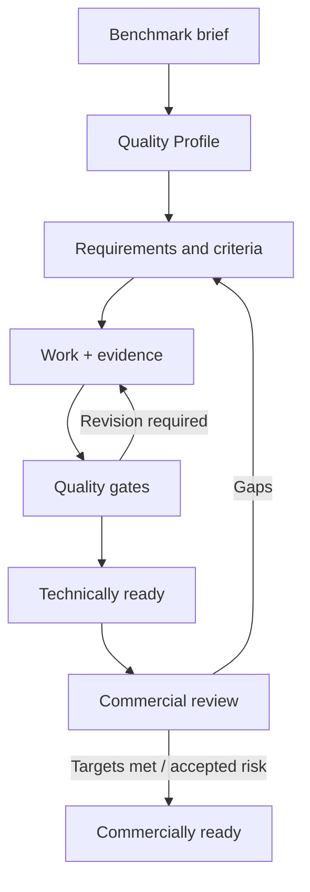

# Commercial Quality Loop

**Level 2–3 — Quality workflow**

> **Source of truth:** `08-quality/COMMERCIAL_QUALITY_FRAMEWORK.md` `08-quality/BENCHMARKING_PROTOCOL.md` `08-quality/QUALITY_GATE_MODEL.md` `08-quality/RELEASE_READINESS_MODEL.md`

## Plain-English explanation

Passing tests proves that something works as specified. Commercial readiness also asks whether the specification and finished product reach the declared market-quality target.

## What this means

“Tests passed” must never automatically become “commercially ready.” Benchmark gaps, quality targets, evidence, risks, and owner acceptance remain visible.

## Technical notes

Gate results and evidence are append-only records. Release readiness exposes separate technical and commercial states.
