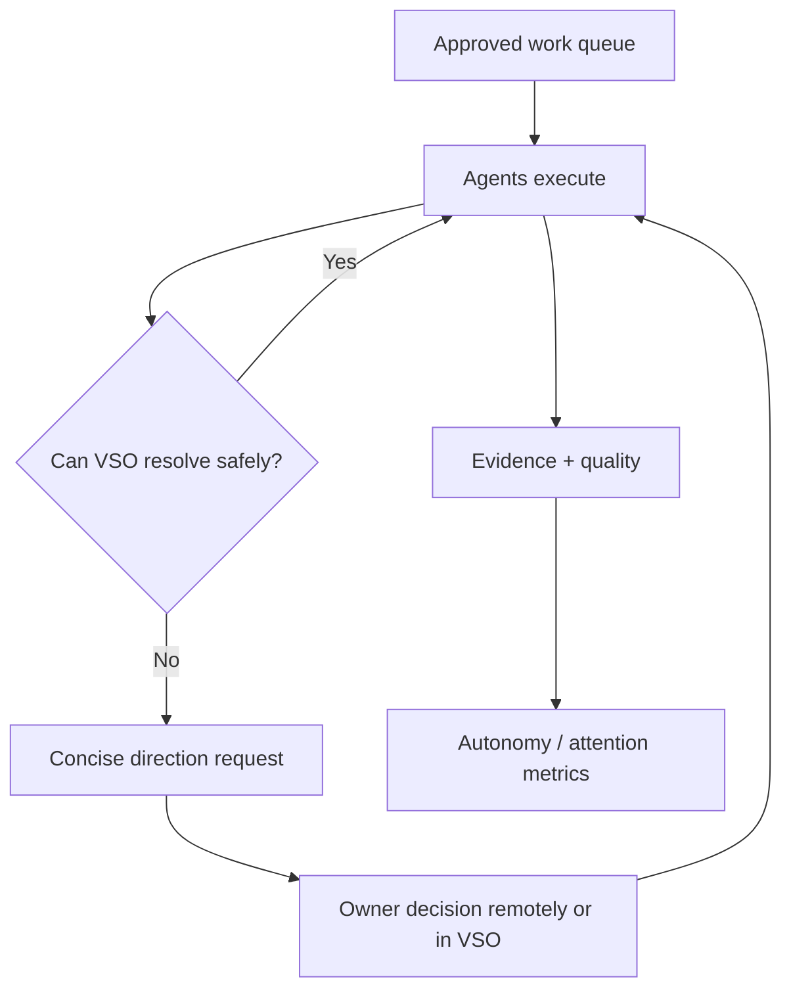

# Owner Attention and Governed Autonomy

**Level 1–3 — Owner operating model**

> **Source of truth:** `01-product/VSO_PRODUCT_DOCTRINE.md` `01-product/SUCCESS_CRITERIA.md` `09-hermes/AUTONOMOUS_EXECUTION_POLICY.md` `04-architecture/DATA_MODEL.md`

## Plain-English explanation

The goal is not to remove the owner. It is to reserve the owner's time for decisions that actually require judgment while agents handle routine approved execution.

## What this means

VSO measures autonomy, first-pass acceptance, recovery, escalation quality, and owner attention time. These metrics may not be improved by hiding necessary risks or skipping checks.

## Technical notes

Attention events and execution/review records supply the metrics. Safety and quality gates outrank attention reduction.
