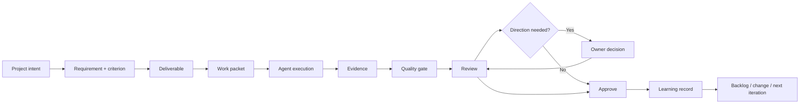

# Smallest Executable VSO Loop

**Level 1–3 — First product proof**

> **Source of truth:** `01-product/SEVL_SCOPE.md` `02-requirements/FUNCTIONAL_REQUIREMENTS.md` `08-quality/TEST_CASES.md`

## Plain-English explanation

Before VSO grows broad, it must prove one complete real loop. A project moves from owner intent to executable work, evidence, review, a possible owner decision, approval, and learning that can drive the next iteration.

## What this means

By the end of Phase 05, `TEST-SEVL-001` must prove this loop with persisted records. Later phases expand capability; they do not substitute for this proof.

## Technical notes

SEVL should use the real state machines, audit records, evidence links, and persistence layer. Mock-only success is prohibited.
